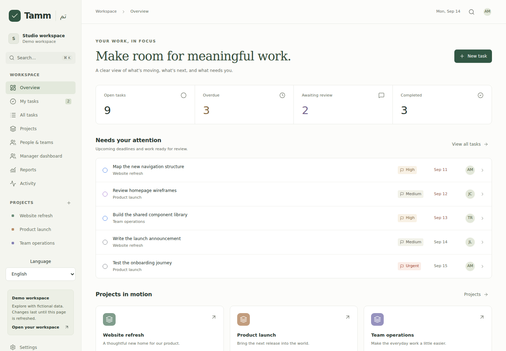

<div align="center">
  
  <h1>Tamm · تم</h1>
  <p>Projects, people, and the next step — together.</p>
  <p>
    <a href="README.ar.md"></a>
  </p>
  <p>
    <a href="https://github.com/mahmoude4477/tamm/actions/workflows/ci.yml"></a>
    <a href="LICENSE"></a>
    
  </p>
</div>

Tamm is an open-source task and project workspace for internal teams. Plan work, assign it, track transfers, and review the result in a focused interface. Monthly reports describe delivery and workload without assigning employees an arbitrary score.

**V1.5 adds recurring work, milestones, capacity planning, and delivery analytics.** The public demo uses fictional data. It contains no personal profile, organization credentials, or production records.



## What you can do

| Area | Included in V1 |
| --- | --- |
| Accounts | Email verification and recovery, profile editing, session controls, optional two-factor authentication and passkeys |
| Organization | Multiple workspaces, invitations, departments, teams, multiple-team membership, custom roles, inactive members |
| Projects | Owners, managers, dates, priorities, visibility, files, activity, archive and restore |
| Tasks | Subtasks, checklists, dependencies, related tasks, multiple assignees, effort, tags, and configurable workflows |
| Review | Submission, approval, return for changes, transfer reasons, optional transfer approval |
| Collaboration | Markdown descriptions and comments, replies, mentions, followers, files, and an inbox |
| Views | Board, configurable table, day/week/month calendar, My Tasks, manager dashboard, saved filters, and search |
| Reports | Monthly metrics, previous-month comparison, scoped filters, CSV, Excel, and PDF |
| Administration | Member and role controls, workflow configuration, settings, trash, and a filterable audit log |
| Languages | English by default, Arabic, automatic direction, and translation fallback |

## Run locally

Requirements: **Node.js 22+**, **PostgreSQL 16+**, and npm.

```bash
git clone https://github.com/mahmoude4477/tamm.git
cd tamm
npm ci
cp .env.example .env.local
```

Set `DATABASE_URL`, `BETTER_AUTH_URL`, and a locally generated `BETTER_AUTH_SECRET`. Do not commit `.env.local`.

```bash
node -e "console.log(require('node:crypto').randomBytes(32).toString('hex'))"
node --env-file=.env.local node_modules/drizzle-kit/bin.cjs migrate
npm run dev
```

Open [localhost:3000](http://localhost:3000). The default development mail transport writes messages to `.data/mail`; open the link in a message to verify an account or exercise recovery. Use SMTP for a deployed installation.

| Route | Purpose |
| --- | --- |
| `/` | Fictional demo; changes disappear on refresh |
| `/login` | Sign in or register when registration is enabled |
| `/workspace` | Your persistent workspace |
| `/board` | Metadata first, 25 tasks per status, load more on demand |
| `/admin` | Account settings and permission-aware workspace administration |
| `/invite` | Accept an invitation using the invited email address |
| `/forgot-password`, `/reset-password` | Account recovery |
| `/verify-2fa` | Authenticator or recovery-code verification |
| `/api/health` | Database readiness |

Create a workspace, add a project, and invite your team from administration. The workspace switcher lets one account work across multiple organizations.

For SMTP, Docker, backups, restore verification, account suspension, and deployment behavior, see **[Operating Tamm](docs/operations.md)**.

## V1 checklist

A checked item means implemented and covered by the release validation. Unchecked items remain open.

### Accounts and organization

- [x] Better Auth accounts, organizations, teams, and workspace switching.
- [x] Email verification, password recovery, and invitation acceptance/expiry/revocation.
- [x] Profile editing, profile photo URLs, session revocation, two-factor authentication, and passkeys.
- [x] Departments, managers, job titles, multiple teams, custom roles, and member deactivation.
- [x] Installation-wide account suspension through the audited operator command.

### Work and collaboration

- [x] Project editing, ownership, dates, priorities, visibility, files, and archive/restore.
- [x] Tasks, independent subtasks, checklists, dependencies, related tasks, and duplicate references.
- [x] Multiple assignees, task types, estimated and actual effort, and tags.
- [x] Configurable statuses, ordering, allowed transitions, approval, and return for changes.
- [x] Assignment history, transfer reasons, team transfer rules, and manager-approved delegation.
- [x] Task and project templates with subtasks and checklists.
- [x] Markdown, comments, editing, deletion, replies, mentions, and followers.
- [x] Validated attachments, authorized downloads, image previews, and soft deletion.
- [x] Notification inbox, read state, preferences, and due-soon/overdue reminders.
- [x] Task/project activity and a separate filterable audit log.

### Views and delivery

- [x] Board, table, calendar, My Tasks, and manager approval/workload views.
- [x] Search across tasks, projects, people, and teams.
- [x] Advanced filters, saved views, shareable filter links, and bulk operations.
- [x] Table sorting, visibility, keyboard resizing, and server pagination.
- [x] Scoped monthly reports, previous-month comparisons, cycle time, reopen/return metrics, and exports.
- [x] English and Arabic dictionaries, locale fallback, timezone configuration, and RTL layout.
- [x] Additive migrations, deployment instructions, and backup/restore documentation.
- [x] Final browser, accessibility, and PostgreSQL validation of the complete V1 branch.

## V1.5 checklist

- [x] Recurring tasks with automatic generation and preserved history.
- [x] Milestones and milestone-linked progress.
- [x] Capacity planning beyond current task counts and effort estimates.
- [x] Advanced delivery analytics and project health indicators.
- [x] Database aggregates and incremental board loading for very large workspaces.
- [x] Scheduled notification delivery and optional upload scanning integration.

- [x] Base UI button/dialog primitives and RTL direction provider, with shadcn configuration.
- [x] Final V1.5 PostgreSQL and browser validation.

## Remaining work — V2

- [ ] Configurable custom fields.
- [ ] Timers, manual time entries, and time reports.
- [ ] Public REST API, webhooks, and integration credentials.
- [ ] Calendar and organizational-system integrations.
- [ ] Optional Hijri date display.
- [ ] Optional AI drafting, summaries, and planning assistance.

### Run the scheduled worker

Set a random `JOBS_SECRET` (at least 32 characters), then run `npm run jobs` beside the app, or schedule `npm run jobs -- --once` each minute. The worker generates due recurring tasks and inbox reminders; it sends email only for members who opt in. PostgreSQL coordinates concurrent workers, so no queue service is required.

Optional ClamAV scanning uses `CLAMAV_HOST` and `CLAMAV_PORT`. When configured, uploads are accepted only after a clean scan; an unavailable scanner rejects the upload. See the operating guide for setup and delivery guarantees.

## For contributors and reviewers

**Stack:** Next.js App Router · React · TypeScript · Tailwind CSS · shadcn/ui with Base UI · Better Auth · PostgreSQL · Drizzle · Zod · TanStack Table.

| Location | Responsibility |
| --- | --- |
| `src/lib/commands.ts` | Validated domain commands, concurrency, dependencies, and reviews |
| `src/lib/permissions.ts` | Built-in and custom application permissions |
| `src/lib/auth.ts` | Better Auth configuration and organization integration |
| `src/db/schema.ts`, `drizzle/` | Relational models and additive migrations |
| `src/db/workspace.ts` | Snapshot loading and changed-row persistence |
| `src/app/api/` | Authorized task, file, inbox, template, audit, and workspace operations |
| `src/components/` | Workspace screens, forms, and shared interface elements |
| `src/messages/en.json` | Source of English product text |
| `src/messages/ar.json`, `src/lib/i18n.ts` | Arabic translations, locale resolution, and English fallback |
| `tests/`, `scripts/integration.mjs`, `e2e/` | Domain, PostgreSQL, and browser checks |

All product copy starts in `en.json`. To add another language, create a matching dictionary, register it in `src/lib/i18n.ts`, and set its direction. Missing translations fall back to English. User-authored task and project content is preserved in its original language.

Workspace commands run under a workspace row lock and save changed records with their audit entry in the same transaction. Composite foreign keys enforce key workspace boundaries. The paginated table uses bounded database queries; the V1.5 board uses paginated queries and delivery analytics use database aggregates. Detailed editing, the original overview/monthly reports, and planning configuration still use a workspace snapshot. See the operational notes before sizing a deployment.

```bash
npm run typecheck
npm test
npm run format:check
npm run build
# Against a disposable, configured database and a running server:
node scripts/integration.mjs
node scripts/auth-integration.mjs
node scripts/planning-integration.mjs
npx playwright install chromium
RUN_AUTH_E2E=true npm run test:e2e
```

V1.5 validation passed type checking, 30 domain/localization/upload-scanning tests, PostgreSQL migrations and integration flows, the production build, and 5 browser checks covering work management, Arabic/mobile navigation, account/passkey setup, overview accessibility, and the complete planning-to-board workflow. CI runs these checks for changes. Integration fixtures use `example.com` accounts and local file email delivery.

The interface follows the principles in [Better UI](https://skills.sh/jakubkrehel/skills/better-ui) and [Emil Design Engineering](https://skills.sh/emilkowalski/skills/emil-design-eng): clear hierarchy, keyboard access, restrained motion, and useful states.

Tamm is licensed under [MIT](LICENSE). The bundled PDF font retains its [DejaVu license](public/fonts/LICENSE-DejaVu.txt).
